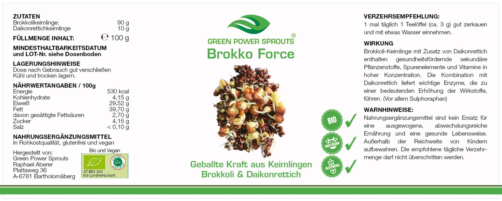

## Ein außergewöhnliches Gesundheitsprodukt.

Brokkoli ist der Spitzenreiter, der Star unter den Kohlgemüsen. Aufgrund seines besonders hohen Wirkstoffgehalts, wurden hier auch die meisten Studien gemacht.
Brokko Force ist eine ideale Keimlingsmischung mit Brokkoli und Daikonrettich, die das Riesenpotenzial der Kohlgemüse auf den Punkt bringt.
Es wird nicht pulverisiert und nicht verkapselt, sondern wird teelöffelweise eingenommen.
Im Vergleich zu Extrakten. wo einzelne Wirkstoffe isoliert werden, bleibt die Synergie der ganzen Pflanze erhalten.

Hier spielen nicht einzelne Instrumente, sondern das ganze Orchester.

Wir haben Methoden entwickelt,  gekeimtes Saatgut auf natürliche Art und Weise noch weiter  zu optimieren. Dadurch entwickelt der Keimling  noch höhere Mengen an Wirkstoffen. So erreichen wir einen hohen Gehalt an Vitaminen, Mineralstoffen und vor allem an dem Glucosinolat Glucoraphanin, das beim Verzehr mit Hilfe von Enzymen, in den begehrten Wirkstoff Sulphoraphan umgewandelt wird.

Wir fügen 10% Daikonrettich Keimlinge hinzu,  ein hochpotenter Enzym- spender (Myrosinase), was eine sehr gute **Umwandlung**  der Vorstufe  Glucoraphanin in  den erwünschten Wirkstoff Sulphoraphan  garantiert. 
Der gängige Herstellungsprozess von Brokkoli Produkten kann dazu führen, dass das Enzym Myrosinase, das zwar auch im Brokkoli enthalten ist, teilweise oder ganz deaktiviert wird. Besonders bei Brokkoli Produkten kommt es nicht nur darauf an, was drin ist, sondern was im Körper, in der Zelle, ankommt. Das kann durch die Metaboliten im Urin gemessen werden.

Zusätzlich deaktivieren wir einen Gegenspieler, einen **Enzym Kofaktor**
( Epithiospecifier Protein), der die Umwandlung in Sulphoraphan behindert und  unerwünschte Stoffe (Sulphoraphan-Nitril und Epithio-Nitril)  produziert, die die Schilddrüse belasten. Wird dieser Kofaktor nicht deaktiviert, wird schlimmstenfalls gar kein oder nur relativ wenig Sulphoraphan gebildet, weil die Vorstufe –das Glucoraphanin – schon anderweitig von der Konkurrenz umgewandelt wurde. Wir haben dann vielleicht ein Produkt mit tatsächlich hohem sulphoraphanbildendem Ausgangsstoff (Glucoraphanin), es wird aber kein Sulphoraphan oder nur sehr wenig davon gebildet. Übrig bleibt ein wirkungsloses Produkt mit möglicherweise schädlicher Wirkung.

Unsere  naturnahen, speziellen Produktionsmethoden hingegen, führen  zu einem hochwirksamen Produkt.  

  
    
      

## Zutaten
### Geballte Kraft aus Keimlingen

Unser Erstprodukt ist seit 2017 erhältlich und wurde vor allem von Therapeuten weiterempfohlen. Es hat seine Feuerprobe bei den Patienten mit Bravour bestanden  – weil es wirkt.
BROKKOLI-KEIMLINGE mit DAIKONRETTICH-KEIMLINGEN
Ein Bio Produkt, glutenfrei, vegan,  in Rohkostqualität.

Zutaten:   
Brokkolikeimlinge  90 g,   
Daikonrettichkeimlinge  10 g  
Füllmenge….Inhalt  100g  

Verzehrempfehlung:    
1 mal täglich 1 Teelöffel (ca. 3 g) gut zerkauen  und mit etwas Wasser einnehmen.

| **Nährwertangaben:  / 100g** |             |
| :--------------------------- | :---------: |
| Energie                      |  530 kcal   |
| Kohlenhydrate                |   4,15  g   |
| Eiweiß                       |   29,52 g   |
| Fett                         |   39,70 g   |
| davon gesättigte Fettsäuren  |   2,70 g    |
| Zucker                       |   4,15 g    |
| Salz                         | unter 0,1 g |

